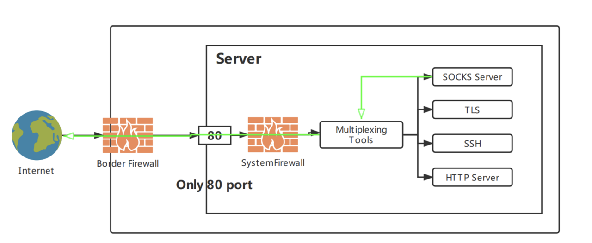
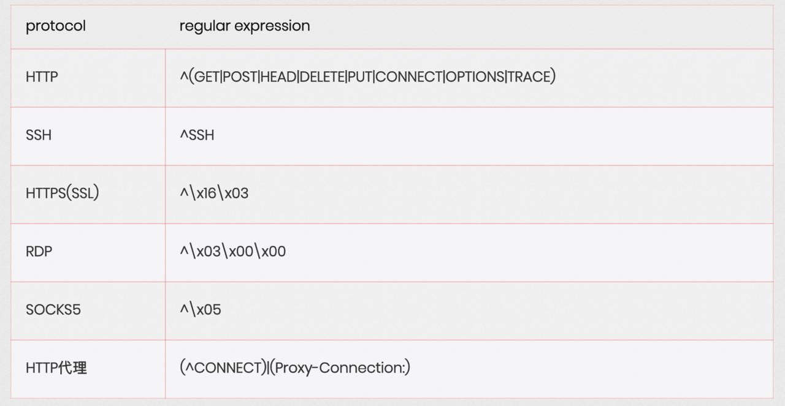

MULTIPLEXING PORT FOR SOCKS5


``
- 本地开启一个socks5代理,端口1234.
- 将80端口的流量转发到8889端口
- 然后在8889端口进行流量分流：http请求就走127.0.0.1:80端口,socks5请求就走10.10.10.241的789端口

win
```
xxxx.exe -type add -lhost 0.0.0.0 -lport 80 -rhost 10.211.55.4 -rport 8889 --socks5 1234 
```
linux

```
./xxxx -type add -lhost 0.0.0.0 -lport 80 -rhost 10.211.55.4 -rport 8889 --socks5 1234
```
Linux 设置一个开关
```
开启功能
echo let_me_on | socat - tcp:10.211.55.25:80
关闭功能
echo let_me_off | socat - tcp:10.211.55.25:80
```

原理


支持协议



参考
https://github.com/TryGOTry/multiplexing_port_socks5